---
hide:
  - navigation
  - toc
---

The architecture uses a memory hook to extract the game state directly from RAM, train an agent with Proximal Policy Optimization (PPO), and enable it to execute its own inputs in the game via memory injection. This approach is based on the original memory manipulation from [SuperHexagonAI](https://github.com/polarbart/SuperHexagonAI). There are two trainers, one with Stable-baselines3 and one that uses PyTorch, which handle the training via a unified Gymnasium environment. The environment interacts with the game via a C++ interface and memory access.

## Diagram

  

