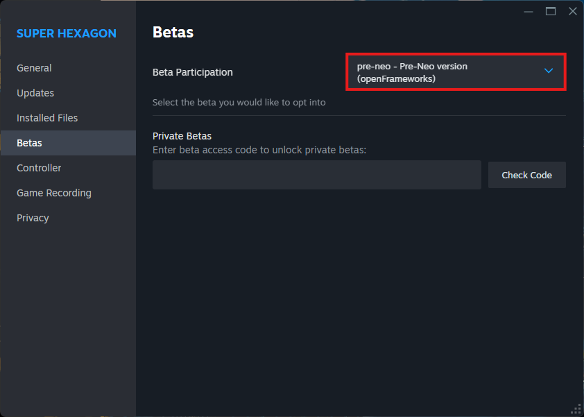

# Getting Started

## Installation

### Prerequisites

Before getting started, ensure you have the following installed on your system:

- **Visual Studio Community Edition 2022**
- **Python 3.12 (not the Microsoft Store version)**
- **CMake**
- **Git**
- **Steam**
- **Pre-Neo Beta version of [Super Hexagon](https://store.steampowered.com/app/221640/Super_Hexagon/)**

---

### Step 1: Install C++ Build Tools, CMake, and Python

Please follow these steps to install **Visual Studio Community Edition 2022**, **CMake**, and **Python 3.12**:

1. Download and run the [Visual Studio Installer](https://visualstudio.microsoft.com/downloads/).

    - During installation, select these components:
      - MSVC C++ x64/x86 Build Tools
      - C++ CMake Tools for Windows
      - Windows 11 SDK

2. Download and install [CMake](https://cmake.org/download/).

    - Ensure CMake is added to your system PATH.

3. Download and install [Python 3.12](https://www.python.org/downloads/release/python-3129/).
    - Ensure Python is added to your system PATH.
    - The Microsoft Store version doesn't work because it blocks system-wide package installation needed for the RLHook library.

---

### Step 2: Install Python Dependencies

Please install the required Python packages using the provided `requirements.txt` file:

```powershell
python -m pip install -r requirements.txt
```

Ensure your `requirements.txt` file contains the following:

```python
ghapi==1.0.6
gymnasium==1.0.0
keyboard==0.13.5
matplotlib==3.10.1
nox==2025.2.9
numpy==2.2.4
opencv_python==4.11.0.86
pytest==8.3.5
rich==13.9.4
setuptools==76.1.0
stable_baselines3==2.5.0
torch==2.6.0
```

---

### Step 3: Setup Super Hexagon

To use this setup, you need **Super Hexagon in the Pre-Neo Steam Beta version**. Ensure the following settings are applied:

- **Run as Administrator:**
  - Right-click `superhexagon.exe`, select `Properties`, go to the `Compatibility` tab, and check **"Run this program as an administrator"**.
- **Windowed Mode & VSync:**
  - The game must be in **windowed mode**, and **VSync should be disabled**.

<div align="center">
  
</div>

Additionally, ensure that both **the Python process and the game process are run with admin privileges**.

---

### Step 4: Clone the Repository

To download the necessary files, run:

```powershell
git clone https://github.com/Stinktopf/SuperHexagonAI.git
cd SuperHexagonAI
```

---

### Step 5: Compile the DLL & Helper Executable

To compile the necessary binaries, execute:

```powershell
cd RLHookLib
python compile_additional_binaries.py
```

---

### Step 6: Install the Library

Install the library globally using pip:

```powershell
pip install .
```

Go to the repository root:

```powershell
cd ..
```

### Step 7: Run the Trainer

Execute a trainer in an administrator command line:

```powershell
python trainer_PPO_GYM_SB3.py
```

or

```powershell
python trainer_PPO_GYM.py
```

or

```powershell
python trainer_DQN_GYM_SB3.py
```
