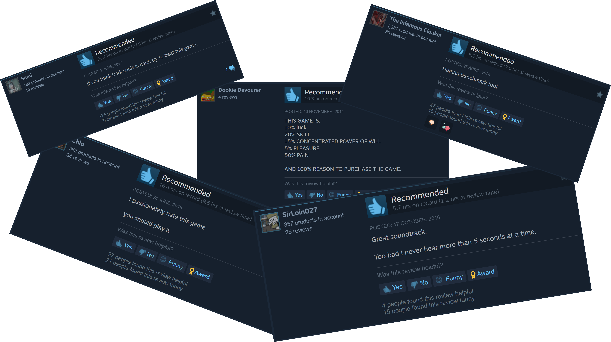

# Super Hexagon Proximal Policy Optimization (PPO)

> **Note:** This is a fork of [SuperHexagonAI](https://github.com/polarbart/SuperHexagonAI), incorporating **Proximal Policy Optimization (PPO)** for reinforcement learning.

## What is Super Hexagon?
**Super Hexagon** is a high-intensity arcade game where players control a small triangle orbiting a central hexagon, avoiding incoming obstacles. Renowned for its extreme difficulty, the game demands sharp reflexes, precision, and rapid pattern recognition to survive.

<iframe width="700" height="438" src="https://www.youtube.com/embed/2sz0mI_6tLQ?si=G1_1qEUr70k6sGr_" title="YouTube video player" frameborder="0" allow="accelerometer; autoplay; clipboard-write; encrypted-media; gyroscope; picture-in-picture; web-share" referrerpolicy="strict-origin-when-cross-origin" allowfullscreen></iframe>

The game features six progressively challenging levels. A level is considered completed when the player survives for 60 seconds. The difficulty ranges from **HARD** to the extreme **HARDESTESTEST**. It's both **demoralizingly tough** and **insanely addictive**.

  

## What is our Project?
Our project extends the [SuperHexagonAI](https://github.com/polarbart/SuperHexagonAI) repository by integrating [Proximal Policy Optimization (PPO)](https://spinningup.openai.com/en/latest/algorithms/ppo.html) instead of the original **Deep Q-Networks (DQN)** approach. We implemented **two versions** of PPO: one using **Stable-Baselines3 (SB3)** for experimentation, and another custom implementation with **Gymnasium and PyTorch** for deeper control over the learning process. Additionally, we updated the original repository to **Python 3.12**, resolved CMake errors, and optimized the environment to work efficiently with direct memory access instead of processing image data.  

### **Gymnasium Environment**  
To train the AI effectively, we created a **custom reinforcement learning environment** for Super Hexagon using **Gymnasium**. Instead of using image data, we access the game's memory directly to construct a structured state representation of the game state:  

- **Wall distances**: A list of normalized distances to the nearest walls for each slot around the central hexagon.  
- **Player orientation**: The normalized sine of the player’s angle, providing a continuous representation of rotation.  
- **Exit direction flag**: A binary indicator showing whether the next safe opening is to the left or right, crucial for fast-turn scenarios.  

The **action space** is discrete and consists of three possible moves: **stay in place, rotate left, or rotate right**. The **reward function** is based on survival time, penalizing the agent upon failure and incorporating adjustments based on angular distance to the next gap.

### **What We Achieved**  
Initially, our agent struggled to survive beyond **five seconds**, but through iterative improvements, it can now reach up to **30 seconds**. The integration of the **"next opening" direction flag** proved particularly useful in handling fast-paced **180-degree turns**.  

  

Additionally, we tested **imitation learning**, using the **DQN model** as a teacher in the reward function. However, this approach did not lead to significant improvements.

### **Related Work**

#### [SuperHexagonAI](https://github.com/polarbart/SuperHexagonAI)
The project "SuperHexagonAI" developed by *polarbart*, implements a reinforcement learning agent for the game Super Hexagon. 
It uses Deep Q-Networks (DQN) combined with Convolutional Neural Networks (CNNs) for processing game frames. 
The agent learns by receiving rewards based on survival time, and the system is optimized using Rainbow extensions like distributional RL and noisy networks. 
Additionally, it uses an external C++ library (PyRLHook) to manage memory and intercept system calls, facilitating efficient frame handling and game speed manipulation.

This project is based on the "SuperHexagonAI" repository, which is why it was forked. However, we differ by implementing Proximal Policy Optimization (PPO) instead of DQN. 
Additionally, our approach trains the agent using direct game variables, rather than relying on image data for frame processing.

#### [super-hexagon-ai](https://github.com/adrianchifor/super-hexagon-ai)

The "super-hexagon-ai" repository by *adrianchifor* was written in C++ and implemented a memory hook into Super Hexagon. 
It researched specific memory locations for key game variables, enabling extraction of valuable game state variables and direct manipulation of the player's rotation. 
The system essentially functions as a "cheat engine" by directly setting the player’s rotation to ensure survival. 

This differs from our approach, where we extend the memory hook to work with game variables in a way that interacts with the game as intended. 
Our implementation uses PPO for training, focusing on game state variables without violating the game rules or manipulating the gameplay directly.

## Find Your Way Around
Follow these links to learn more about the different aspects of our project:

- [Getting Started](./getting-started.md): Instructions for installing and starting the project.
- [Architecture](./architecture.md): Description of the architecture for implementing Proximal Policy Optimization.
- [Implementation](./interface.md): Detailed explanation of the implementation.
- [Performance](./performance.md): Analysis of performance and comparison with existing implementations.
